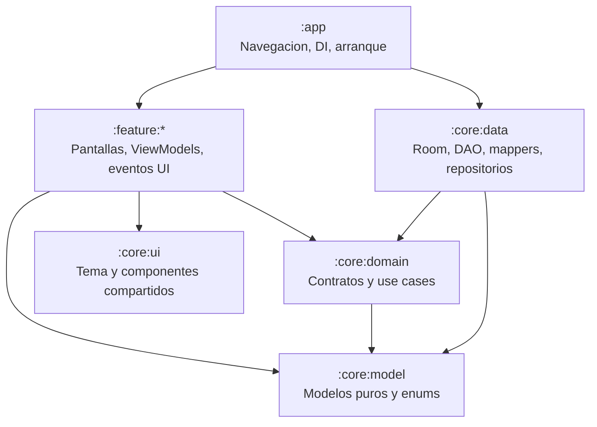

# ARCHITECTURE.md - Arquitectura de EstudiApp

Este documento explica donde vive cada responsabilidad y como deben relacionarse los modulos.

## Diagrama de Capas



La direccion conceptual es:

`feature:* -> core:domain/core:model/core:ui`

`core:data -> core:domain/core:model`

`:app -> feature:* + core:data para wiring`

## Reglas de Dependencia

Permitido:

- `:feature:*` importa `:core:model`.
- `:feature:*` importa `:core:domain`.
- `:feature:*` importa `:core:ui`.
- `:core:data` implementa contratos de `:core:domain`.
- `:app` conoce features y `:core:data` para navegacion, Hilt y arranque.

Prohibido:

- `:feature:*` importando `:core:data`.
- `:core:model` importando cualquier otro modulo del proyecto.
- `:core:domain` dependiendo de `:core:data`.
- `:core:ui` dependiendo de features.
- Features importandose entre si sin una decision arquitectonica explicita.
- Composables accediendo a DAO, entidades Room o repositorios concretos.

## Ownership por Modulo

### `:app`

Responsable de:

- `MainActivity`.
- `Application`.
- Navigation host.
- Top-level destinations.
- Wiring general de DI.

No debe contener:

- reglas academicas;
- queries;
- logica de persistencia;
- componentes visuales grandes.

### `:core:model`

Responsable de:

- data classes puras de dominio;
- enums;
- sealed interfaces;
- value objects simples;
- extensiones de dominio sin dependencias Android cuando sea posible.

No debe contener:

- Room annotations;
- Compose;
- Hilt;
- Android Context;
- DAO o repositories.

### `:core:domain`

Responsable de:

- contratos de repositorio;
- use cases;
- reglas de negocio;
- composicion de flujos de dominio;
- tests unitarios de comportamiento.

No debe contener:

- entidades Room;
- implementaciones concretas de persistencia;
- UI Compose.

### `:core:data`

Responsable de:

- Room database;
- DAO;
- entidades;
- migraciones;
- mappers;
- implementaciones de repositorios;
- DataStore, SAF, backups y lectores locales.

No debe contener:

- pantallas;
- componentes Compose;
- reglas visuales;
- tipos especificos de una feature.

### `:core:ui`

Responsable de:

- tema visual;
- tokens;
- componentes compartidos;
- tarjetas reutilizables;
- controles reutilizables;
- componentes docentes o academicos cuando ya tienen uso transversal.

No debe contener:

- ViewModels;
- repositories;
- DAO;
- navegacion concreta de feature;
- reglas de negocio que deban vivir en domain.

### `:feature:*`

Responsable de:

- pantallas;
- ViewModels;
- eventos UI;
- estado UI;
- componentes locales de la feature;
- adaptacion de use cases al flujo visual.

No debe contener:

- entidades Room;
- DAO;
- mappers de persistencia;
- acceso directo a `:core:data`;
- componentes duplicados que ya pertenecen a `:core:ui`.

## Donde Poner Cada Cosa

- Modelo academico reutilizable: `:core:model`.
- Estado puramente visual: feature local.
- Regla de negocio: `:core:domain`.
- Consulta o escritura local: `:core:data`.
- Mapper dominio <-> entidad: `:core:data/mapper`.
- Componente visual reusable por varias features: `:core:ui`.
- Componente visual especifico de una pantalla: `feature/*/components`.
- Ruta principal: `:app/navigation`.
- Pantalla nueva: modulo `:feature:*` correspondiente.
- Texto visible: `res/values/strings.xml` del modulo dueno.

## Ejemplos Buenos y Malos

Bueno:

```kotlin
class PlannerViewModel(
    private val observePlannerUiState: ObservePlannerUiStateUseCase
) : ViewModel()
```

La feature consume un use case de dominio.

Malo:

```kotlin
import com.estudiapp.core.data.local.dao.StudyTaskDao
```

Una feature no debe conocer DAO ni `:core:data`.

Bueno:

```kotlin
data class StudyTask(
    val status: StudyTaskStatus
)
```

El estado esta tipado en el modelo.

Malo:

```kotlin
val status = "done"
```

Los estados de negocio no deben depender de strings sueltos.

Bueno:

```kotlin
@Composable
fun PlannerScreen(
    uiState: PlannerUiState,
    onTaskDone: (String) -> Unit
)
```

La UI renderiza estado y emite eventos.

Malo:

```kotlin
@Composable
fun PlannerScreen(dao: StudyTaskDao)
```

La UI no debe recibir persistencia directa.

## Plantilla para Nueva Entidad Room

1. Crear o actualizar modelo en `:core:model`.
2. Crear entidad en `:core:data/local/entity`.
3. Crear o actualizar DAO en `:core:data/local/dao`.
4. Crear mapper en `:core:data/mapper`.
5. Exponer operaciones en contrato de `:core:domain`.
6. Implementar operaciones en repository de `:core:data`.
7. Agregar entidad a `EstudiDatabase`.
8. Subir version de Room.
9. Agregar migracion en `DatabaseMigrations.kt`.
10. Registrar providers en DI si corresponde.
11. Validar con `./scripts/sanity-check.ps1` y `./gradlew.bat :app:assembleDebug --console=plain --no-daemon`.

## Plantilla para Nuevo Use Case

1. Confirmar que la regla no pertenece solo al ViewModel.
2. Crear use case en `:core:domain/usecase`.
3. Consumir contratos, no implementaciones.
4. Cubrir con test unitario si contiene decision relevante.
5. Inyectar en ViewModel de la feature.

## Plantilla para Nueva Pantalla

1. Confirmar modulo dueno.
2. Crear pantalla y ViewModel en `:feature:*`.
3. Definir `UiState` y eventos.
4. Consumir use cases/repositorios via contratos de dominio.
5. Extraer secciones densas a `components/`.
6. Agregar ruta en `:app/navigation`.
7. Validar entradas desde pantallas relacionadas.

## Plantilla para Nuevo Componente Compartido

1. Confirmar que tiene uso real en mas de una feature o que reemplaza duplicacion evidente.
2. Ubicarlo en `:core:ui`.
3. Mantener API visual, no acoplarla a ViewModels.
4. Pasar datos y callbacks simples.
5. Reusar tokens de tema.
6. Migrar usos existentes si corresponde.

## Plantilla para Nuevo Destino de Navegacion

1. Definir ruta centralizada en `:app/navigation`.
2. Evitar strings dispersos.
3. Definir argumentos claros y parseo seguro.
4. Agregar entrada desde pantallas relacionadas.
5. Mantener deep links o fallbacks si aplican.
6. Validar con build de app.

