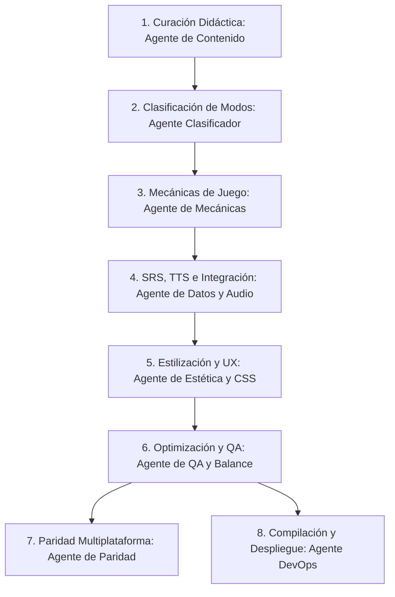

# Orquestación de Agentes para Juegos Interactivos

Esta carpeta contiene las instrucciones del sistema (prompts) y perfiles operativos para los agentes de IA encargados del ciclo de vida de los juegos en **EstudiApp Web**.

El objetivo es subdividir las tareas complejas de desarrollo en roles específicos para lograr implementaciones más de talladas, limpias, estéticas y con menos errores.

## Mapa de Agentes Especializados

Para cualquier tarea relacionada con juegos y herramientas de estudio, puedes invocar o configurar una instancia de IA con uno de los siguientes perfiles:

### Creación y Desarrollo de Juegos
1. **[Agente de Mecánicas y Lógica](agent_game_mechanics.md):** 
   - *Rol:* Diseñar y refactorizar la lógica interna, el bucle de juego, las transiciones de estado, la puntuación y la integración con el motor `StudyEngine` y el algoritmo SRS.
   - *Especialidad:* JavaScript (ES6), lógica condicional, control de flujo.

2. **[Agente de Estética, Animación y CSS](agent_game_aesthetics.md):**
   - *Rol:* Asegurar que el juego se vea premium y dinámico de acuerdo con las directrices de diseño web moderno.
   - *Especialidad:* CSS avanzado, HSL, animaciones `@keyframes`, transiciones suaves, sistemas de partículas DOM/Canvas, responsividad móvil y accesibilidad.

3. **[Agente de Datos, TTS y Audio](agent_game_integration.md):**
   - *Rol:* Conectar los juegos con los recursos de datos de vocabulario, generar distractores dinámicos robustos, integrar efectos de sonido (`fx.js`), configurar la síntesis de voz (TTS en `speech.js`) y generar códigos de verificación seguros para profesores.
   - *Especialidad:* Procesamiento de cadenas, APIs de audio web, algoritmos de selección (distractores), criptografía y hashes.

4. **[Agente de QA, Rendimiento y Balance](agent_game_qa.md):**
   - *Rol:* Identificar fugas de memoria (timers, listeners), optimizar el renderizado, verificar casos límite (mazos vacíos o muy cortos, palabras extremadamente largas) y ajustar la curva de dificultad del juego.
   - *Especialidad:* Debugging, perfiles de memoria, optimización del DOM, testing manual y automatizado.

### Integración, Paridad y DevOps
5. **[Agente de Paridad de Plataformas](agent_platform_parity.md):**
   - *Rol:* Mantener la equivalencia funcional y de diseño entre la versión Web y la versión Android nativa (`StudiApp`), traduciendo lógicas y evitando desviaciones del producto.
   - *Especialidad:* Kotlin, Jetpack Compose, TypeScript/JavaScript, bases de datos (Room vs LocalStorage).

6. **[Agente de Automatización y Pipelines (DevOps)](agent_devops.md):**
   - *Rol:* Validar compilaciones, automatizar la regeneración de presets (`build_presets.js`), controlar la resolución de rutas relativas y gestionar flujos de despliegue seguros en GitHub Pages.
   - *Especialidad:* CI/CD, Node.js scripts, PowerShell/Bash, git.

7. **[Agente de Contenido y Curación Didáctica](agent_content.md):**
   - *Rol:* Estructurar y auditar la base de datos de packs (`packs.json`), normalizar cadenas de vocabulario para TTS y asegurar la coherencia pedagógica de los materiales de estudio.
   - *Especialidad:* Estructuración JSON/TSV, lingüística aplicada, Web Speech API.

8. **[Agente de Clasificación y Asignación de Modos](agent_game_classifier.md):**
   - *Rol:* Evaluar la estructura del vocabulario y asignar qué juegos son aptos para jugarse (ej. deshabilitar Wordle para oraciones o Sniper para textos largos).
   - *Especialidad:* Análisis estático de datos, taxonomía y ludificación.

---

## Cómo Utilizar Estos Agentes

Cuando trabajes con un asistente de IA (o configures subagentes en tu IDE/entorno de desarrollo), puedes asignarle su rol específico siguiendo estos pasos:

1. **Copia el contenido** del agente correspondiente (por ejemplo, [agent_game_aesthetics.md](agent_game_aesthetics.md)).
2. **Pégalo al inicio de la conversación** (o añádelo como instrucciones de contexto del sistema).
3. **Describe tu tarea de forma concreta**, por ejemplo: *"Utilizando tu rol de Agente de Estética, añade una animación de explosión de partículas cuando un globo explote en bubble.js y mejora los colores para que combinen con el modo oscuro"*.

## Flujo de Trabajo Colaborativo

Al crear o actualizar packs, juegos y plataformas en EstudiApp, el flujo completo de colaboración es:



- **Fases 1-2:** Aseguran la calidad del vocabulario y definen qué juegos tienen sentido pedagógico y jugable.
- **Fases 3-4:** Crean la base lógica y de contenido del pack o minijuego.
- **Fase 5-6:** Pulen la experiencia interactiva, garantizan que funcione sin problemas y sea fluida.
- **Fases 7-8:** Despliegan los cambios a la web y aseguran la paridad con la versión nativa de Android.

---

## 🛠️ Herramientas de Validación y Soporte

Se incluye el script automático de control de calidad:
- **[validate_games.js](../../scripts/validate_games.js):** Valida la estructura de cada clase de juego en `js/modules/games/`, comprobando la definición de constructor, hooks de ciclo de vida (`start()`, `stop()`), exportación y avisos de color básico CSS.
  - *Ejecución:*
    ```bash
    node scripts/validate_games.js
    ```
